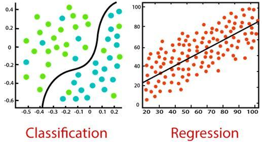

# ml-study
machine learning study

# install
```bash
!pip3 install -U scikit-learn
!pip3 install pandas
!pip3 install graphviz
!pip3 install matplotlib
```

# 概念
人工智能：用计算机来构造复杂的、拥有与人类智慧同样本质特性的机器，能够与人一样，甚至比人更好地执行特定任务的技术。

机器学习：一种实现人工智能的方法，是使用算法来解析数据、从中学习，然后对真实世界中的事件做出决策和预测，涉及概率论、统计学、逼近论、凸分析、算法复杂度理论等多门学科。

深度学习：是机器学习的一种，其动机在于建立、模拟人脑进行分析学习的神经网络，它模仿人脑的机制来解释数据。

神经网络：一种机器学习的算法，神经网络在设计的时候就是模仿人脑的处理方式，希望其可以按人类大脑的逻辑运行。


# 机器学习
机器学习人工智能最基本的做法，是人工智能的核心，是使用算法来解析数据、从中学习，然后对真实世界中的事件做出决策和预测。

## 监督学习
它从过去的数据中学习，并将学习的结果应用到当前的数据中，以预测未来的事件。分为分类或回归模型。
- 1.回归模型：用于输出变量为实际值的问题，例如单一的数字、美元、薪水、体重或压力。它最常用于根据先前的观测数据来预测数值。一些比较常见的回归算法包括线性回归、逻辑回归、多项式回归和脊回归。
- 2.分类模型：用于可以对输出变量进行分类，例如“是”或“否”、“通过”或“失败”。分类模型用于预测数据的类别。现实生活中的例子包括垃圾邮件检测、情绪分析、考试记分卡预测等。


实际应用：文本分类、垃圾邮件检测、天气预报、根据当前市场价格预测房价、股票价格预测等、人脸识别、签名识别、客户发现
常见算法：线性回归、神经网络、决策树、支持向量机、KNN、朴素贝叶斯算法


## 无监督学习
无监督学习是训练机器使用既未分类也未标记的数据的方法。机器只能自行学习，必须能够对数据进行分类，而无需事先提供任何有关数据的信息。

实际应用：恶意软件检测、数据输入过程中人为错误识别、进行准确的购物篮分析等、欺诈检测

常见算法：主成分分析法（PCA）、异常检测法、自编码算法、深度信念网络、赫比学习法、生成式对抗网络、自组织映射网络


## 半监督学习
其训练数据的一部分是有标签的，另一部分没有标签，而没标签数据的数量常常极大于有标签数据数量


